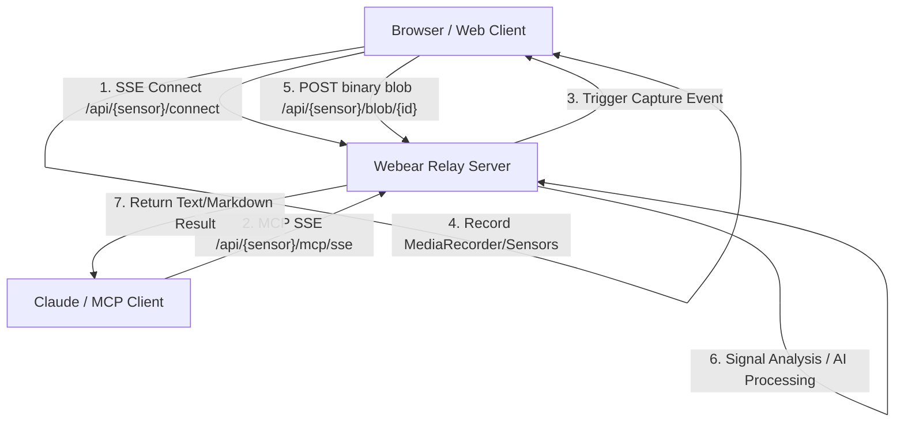

# AI Perception Platform

"Your AI can think. Now let it hear, see, and feel."

## The Vision
AI models (LLMs) currently operate as "brains in a jar." They possess high cognitive intelligence and logical reasoning, but lack real-time sensory perception of the physical or digital environments their users are active in. The **AI Perception Platform** is an infrastructure layer designed to deliver real-time sensory capabilities to AI models via standardized Model Context Protocol (MCP) APIs.

Instead of a user manually describing audio, layouts, or metrics to a model, the platform grants the AI its own direct senses:
- **WebEar (AI Hearing):** Real-time audio capture, signal analysis, rhythmic analysis, and mix coaching.
- **WebEye (AI Sight):** Video, canvas, and UI layout capture, computer vision, visual comparison, and design critique.
- **WebSense (AI Feeling):** Real-time telemetry, haptics, and system/sensor data streams.

---

## Core Architecture Pattern
The platform uses a unified sensor-agnostic infrastructure, enabling new modalities to be added rapidly by reusing the same transport and auth mechanics.

### Shared Reusable Infrastructure
1. **SSE Browser Relay (`/api/{sensor}/connect`):** Maintains persistent Server-Sent Events connections from active browser tabs, keyed by user/developer API keys.
2. **Blob Storage Engine (`/api/{sensor}/blob/:captureId`):** Temporary in-memory cache with eviction policies to store captured sensory data without risking disk or RAM exhaustion.
3. **MCP SSE Transport & Messages:** Standardized JSON-RPC protocol implementation for Claude Code and other MCP clients.
4. **Credit Ledger Billing:** Billed usage per tool call based on compute costs (e.g., simple analysis vs. high-tier multimodal processing).

---

## Roadmap

### Phase 1: WebEar (AI Hearing) — COMPLETE
- **Status:** Shipped & Working.
- **Tools:**
  - `capture_audio` (Free): Captures tab audio via Tone.js tap.
  - `analyze_audio` (1 credit): Decodes PCM and calculates RMS, peak, dynamic range, spectral centroid, frequency bands, and BPM.
  - `describe_audio` (2 credits): High-fidelity description using Gemini multimodal voice analysis.
  - `diff_audio` (1 credit): Structural comparison delta report (A/B testing).
  - `groove_score` (2 credits): Isolation of kick drums, grid alignment optimization, swing percentage, and tightness rating.
  - `capture_and_analyze` (1 credit): Capture and signal analysis combined.
  - `mix_coach` (3 credits): Virtual mix coaching feedback.

### Phase 2: WebEye (AI Sight) — ACTIVE
- **Status:** Building browser capture snippet.
- **Concept:** Allowing models to inspect HTML5 canvases, video elements, and browser viewport layout to perform automated design critiques, layout bug detection, and visual verification.
- **Target Tools:**
  - `capture_video` / `capture_frame`: Capture a canvas stream or screenshot.
  - `diff_visuals`: Perform structural pixel and layout delta analysis.
  - `ui_critique`: Analyze contrast, spacing, accessibility compliance, and visual balance.

### Phase 3: WebSense (AI Telemetry/Feeling) — FUTURE
- **Concept:** Exposing real-time telemetry, haptics, CPU profiles, or streaming performance data as a direct feed to the AI.
